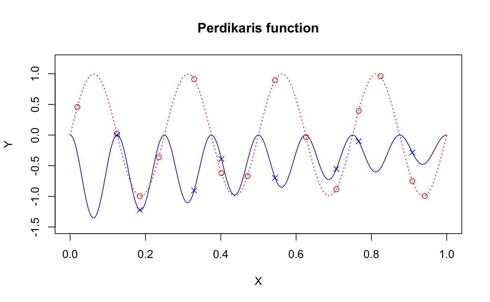
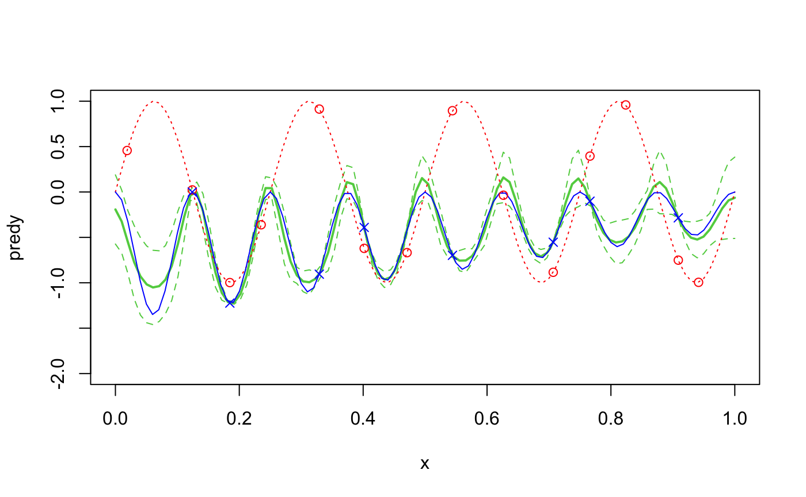

# RNAmf

The `RNAmf` package for <tt>R</tt> provides an emulation of 
a recursive non-additive (RNA) surrogate model for multi-fidelity computer experiments,
by incorporating the outputs from previous layer to the input,
which enables a comprehensive analysis of complex computer codes, 
capturing functional correlations between different fidelity levels and enhancing the modeling and prediction capabilities.  
The package includes an three active learning strategies for RNA emulator. 
Squared exponential kernel and Matern kernel-1.5, 2.5 are available for covariance structure. 
This readme aims to introduce how to use this package. 

Details are
> <arXiv:2309.11772>

Maintainer: Junoh Heo <heojunoh@msu.edu>

## Installation

``` r
install.packages("devtools")
library(devtools)
devtools::install_github("heojunoh/RNAmf")
```

## Motivating Example
### Nonlinear example function (Perdikaris et al., 2017)
Perdikaris function is an example of multi-fidelity function with nonlinear relationships between data at different fidelity levels. The following code defines the Perdikaris function with low-fidelity `f1` and high-fidelity `f2`. 

```{r}
library(lhs)
library(ggplot2)
library(hrbrthemes)

### synthetic function ###
f1 <- function(x)
{
  sin(8*pi*x)
}

f2 <- function(x)
{ 
  (x-sqrt(2))*(sin(8*pi*x))^2
}
```

Consider the data which is assumed to be deterministic, i.e., without noise. Samples of $n_1=13$ and $n_2=8$ points are designed to be nested $\mathcal{X}_2 \subseteq \mathcal{X}_1$.
```{r}
### training data ###
n1 <- 13
n2 <- 8

### fix seed to reproduce the result ###
set.seed(1)

### generate initial nested design ###
X <- NestedX(c(n1, n2), 1)
X1 <- X[[1]]
X2 <- X[[2]]

y1 <- f1(X1)
y2 <- f2(X2)

### grid points ###
x.test <- seq(0, 1, length.out = 1000)
y.test <- f2(x.test)

### plot ###
plot(x.test, y.test, type = "l", col="blue", xlab = "X", ylab = "Y", main = "Perdikaris function", ylim=c(-1.5,1.2))
curve(f1(x), add=TRUE, col="red", lty=2)
points(X1, y1, col="red", pch=1)
points(X2, y2, col="blue", pch=2)
```
The red dotted line represents the low-fidelity function, and the blue solid line indicates the high-fidelity function. The plot shows that the functions with different fidelity level are nonlinearly correlated. 




-------

## Model

### Gaussian Processes

Gaussian Processes (GPs) are connected in a coupled manner in RNA emulator. Before elaborating the RNA emulator, GPs are introduced in this section. GPs are one of the most effective tools in computer experiments. GPs are defined as $Z(\mathbf{x}) \overset{indep.}{\sim} \mathcal{GP}\{\alpha(\mathbf{x}),\tau^2\Phi(\mathbf{x},\mathbf{x}')\}$, where $\alpha(\mathbf{x})$ is a mean function, $\tau^2$ is a variance parameter, and $\Phi(\mathbf{x},\mathbf{x}')$ is a positive-definite kernel function. 

The mean function $\alpha(\mathbf{x})$ is often assumed to be $h(\mathbf{x})\beta$, where $h(\mathbf{x})$ is a vector of $d$ regression functions, but constant mean $\alpha(\mathbf{x})=\mu$ or zero-mean $\alpha(\mathbf{x})\equiv 0$ are common choices as well. 

Anisotropic kernel function $\Phi(\mathbf{x},\mathbf{x}')=\prod^d_{j=1}\phi(x_j,x_j';\theta_{lj})$ is adopted, where $(\theta_{l1},\ldots,\theta_{ld})$ is the lengthscale hyperparameter, indicating that the correlation decays exponentially fast in the squared distance between $\mathbf{x}$ and $\mathbf{x}'$. Squared exponential kernel $\phi(x,x';\theta) = \exp \left( -\frac{ \left( x - x' \right)^2}{\theta} \right)$ or Mat\'ern kernel with smoothness parameter of 1.5 $\phi(x,x';\theta) =\left( 1+\frac{\sqrt{3}|x- x'|}{\theta} \right) \exp \left( -\frac{\sqrt{3}|x- x'|}{\theta} \right)$ or smoothness parameter of 2.5 $\phi(x, x';\theta) =  \left( 1+\frac{\sqrt{5}|x-x'|}{\theta} +\frac{5(x-x')^2}{3\theta^2} \right) \exp \left( -\frac{\sqrt{5}|x-x'|}{\theta} \right)$ are most commonly used.

The parameters $\alpha,\tau^2,\mathbf{\theta}$ can be estimated by maximum likelihood estimation via `optim` with `method = "L-BFGS-B"`. 


### RNA emulator

To achieve better flexibility, RNA emulator is proposed in a recursive fashion:
$f_1(\mathbf{x})=W_1(\mathbf{x})$ ,
$f_l(\mathbf{x})=W_l(\mathbf{x}, f_{l-1}(\mathbf{x}))$, for $l=2,\ldots,L$,
with modelling $W_l$ by GPs. `RNAmf_two_level` and `RNAmf_three_level` functions provides the `RNAmf`-class RNA emulator with $l=2$ or $l=3$, with aforementioned kernel choices by `kernel="sqex"`, `kernel="matern1.5"`, or `kernel="matern2.5"`.

```{r}
### n=100 uniform test data ###
x <- seq(0, 1, length.out = 100)

### fit an RNAmf ###
fit.RNAmf <- RNAmf_two_level(X1, y1, X2, y2, kernel = "sqex")

### predict ###
predy <- predict(fit.RNAmf, x)$mu
predsig2 <- predict(fit.RNAmf, x)$sig2

### RMSE ###
sqrt(mean((predy - f2(x))^2))

### visualize the emulation performance ###
plot(x, predy,
  type = "l", lwd = 2, col = 3, # emulator and confidence interval
  ylim = c(-2, 1)
)
lines(x, predy + 1.96 * sqrt(predsig2 * length(y2) / (length(y2) - 2)), col = 3, lty = 2)
lines(x, predy - 1.96 * sqrt(predsig2 * length(y2) / (length(y2) - 2)), col = 3, lty = 2)

curve(f1(x), add = TRUE, col = "red", lwd = 1, lty = 3) # high fidelity function
curve(f2(x), add = TRUE, col = "blue", lwd = 1, lty = 1) # high fidelity function

points(X1, y1, pch = 1, col = "red") # low-fidelity design
points(X2, y2, pch = 4, col = "blue") # high-fidelity design
```
The green solid line is the prediction of the emulator with the dotted line as 95% confidence intervals. The posterior mean closely aligns with the true function, and the confidence intervals can cover the true function. This indicates that the RNA emulator implemented by `RNAmf_two_level` can capture the nonlinear relationship. 



``` r
print(sqrt(mean((predy - f2(x))^2)))
[1] 0.09609978
```

-------

## Active learning
Active learning is being updated now.


